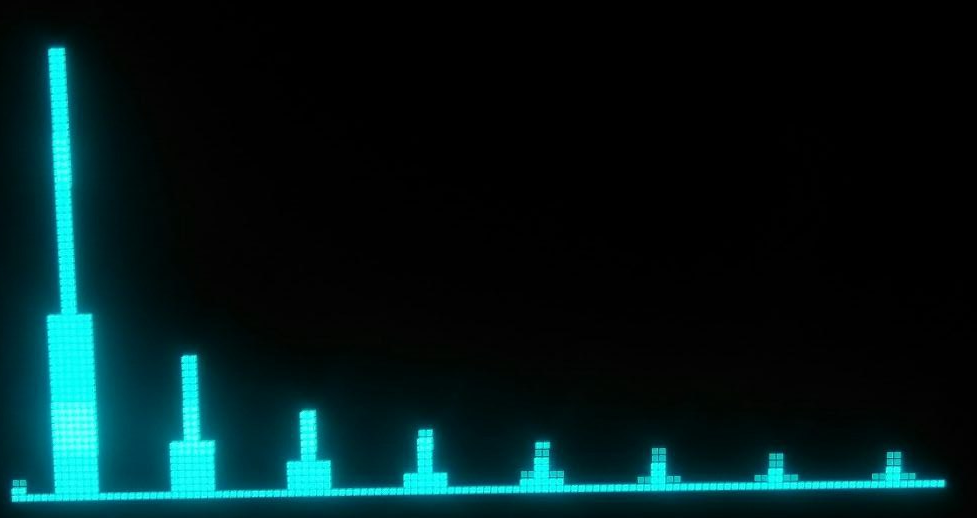
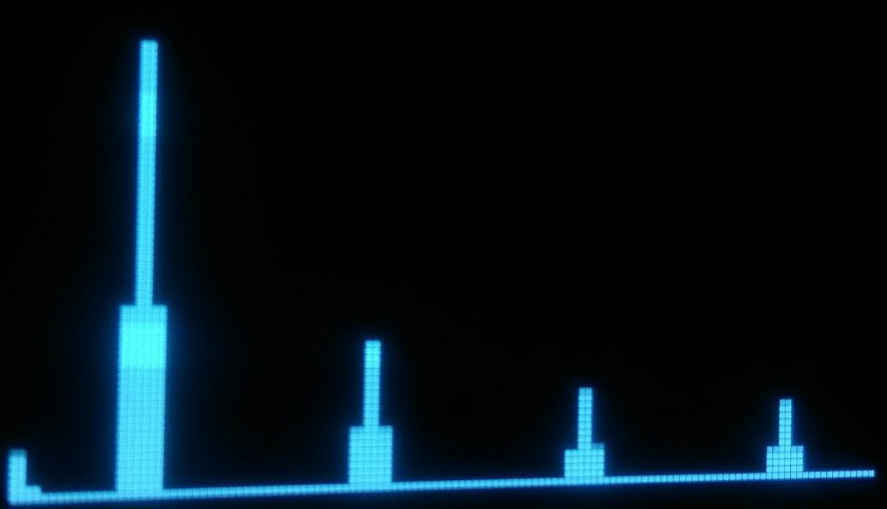
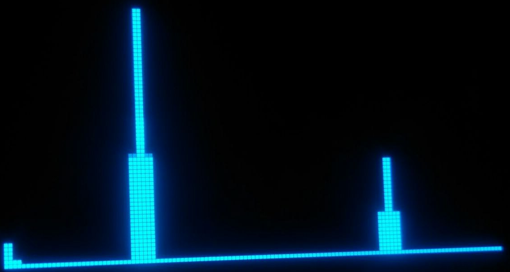

# CH32V003-EXAMPLES-

# Simple blink.
  My first blink on RISK-V
# Spectrum analyzer
  128 points FFT (fixed point 16bsts FFT). CH32V003 + SPD0301 (SSD1306) + ADC + TIM2 + SPI + DMA.
  Spectrum analyzer based on RISK-V MCU CH32V003 (with RV32E CPU core without multiplying instructions). 
  Software multiplying takes almost 400 nS which is quite good. The result of conversion is drawing on the OLED display built on the SPD0301 controller via 
  SPI.
  The schematic tracer of the device:

  The device can work in three sampling rate modes:
  - 32000 Sp/s
  - 16000 Sp/s
  -  8000 Sp/s
  
  For different speed modes, it is necessary to design a Low-pass filter with a cut-off frequency that is equal to half of the sampling rate to avoid 
  aliasing.
  Based on sample rates the resolution in the frequency zone is next: 
  
    F0 = Fs/N 
  
  Where F0 - fundamental frequency; Fs - sampling rate; N - number of samples. So, for Fs = 32000 Hz, the fundamental frequency is equal to 32000 / 128 = 
  250.   
  (For Fs = 316000 Hz, F0 = 125 Hz. And for Fs = 8000 Hz, F0 = 62,5 Hz). The frequency that could be displayed depends on the sample rate too. 
  A.e for Fs = 32000 Hz, we can display 64 bins from 0 Hz to 15750 Hz with step 250 Hz.
  For Fs = 16000 Hz, we can display 64 bins from 0 Hz to 7875 Hz with step 125 Hz.
  For Fs = 8000 Hz, we can display 64 bins from 0 Hz to 3937,5 Hz with step 62,5 Hz.

  The result of the FFT is shown as 64 bars with linear frequency and linear amplitude change.
  The result of the transformation of the square signal with a frequency of 1 kHz is shown in the next picture:
  
  

  Fs = 32 kSp/s: (Here possible to see odd harmonics 1 - 15)
  

  Fs = 16 kSp/s: (Here possible to see odd harmonics 1 - 7)
  

  Fs = 8 kSp/s: (Here possible to see odd harmonics 1 - 3)
  

  Sampling, screen drawing and computations are performed in parallel to minimize the screen preparation time. So, for the sampling and the communication with the display via SPI (because it's faster than I2C) the DMA is used. The framerate partially depends on the sample rate. As one can see on the flowchart below, there are two time-consuming processes. It's sampling and Fourier transformation. The time of FFT (Hamming window application, FFT, Amplitudes computing and screen building) is equal to 9,5 s. Sampling time depends on sampling rate (4 ms for 32 kHz, 8 ms for 16 kHz and 16 ms for 8 kHz). So, the framerate is limited by FFT for Fs 32 kHz and 16 kHz and is 100 - 105 FPS; for Fs = 8 kHz, the framerate is limited by sampling and is 63 FPS.

  
  
  
  
